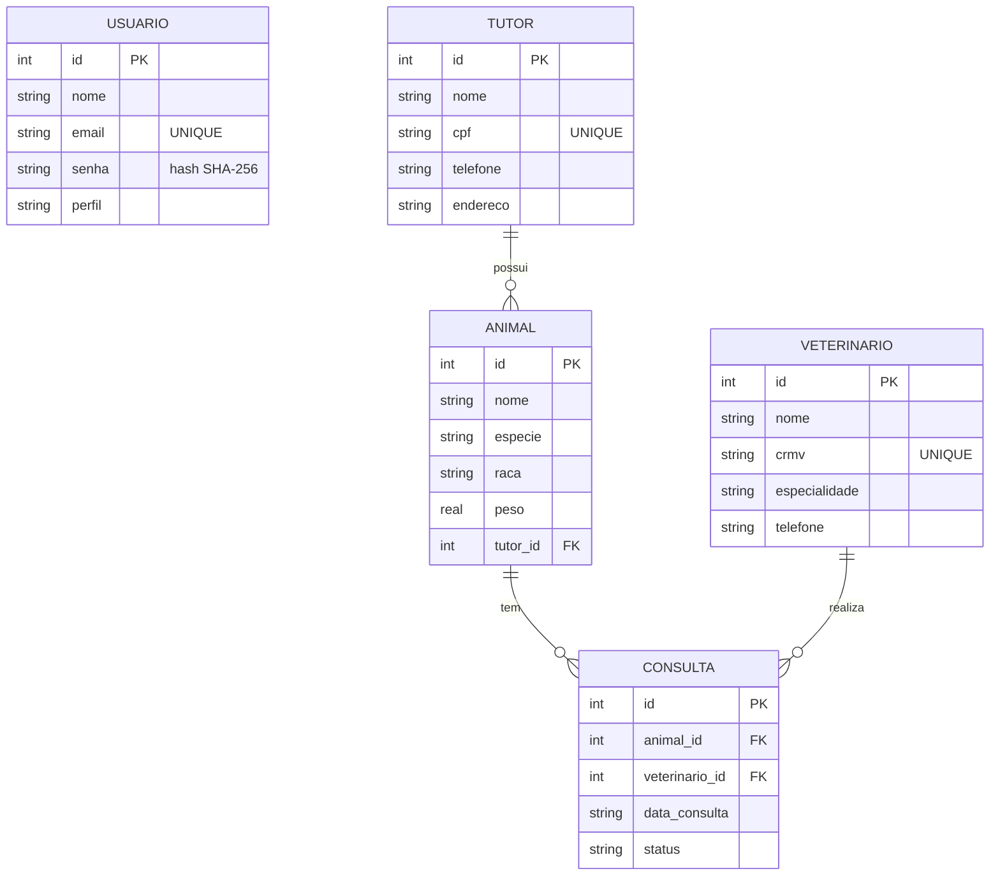
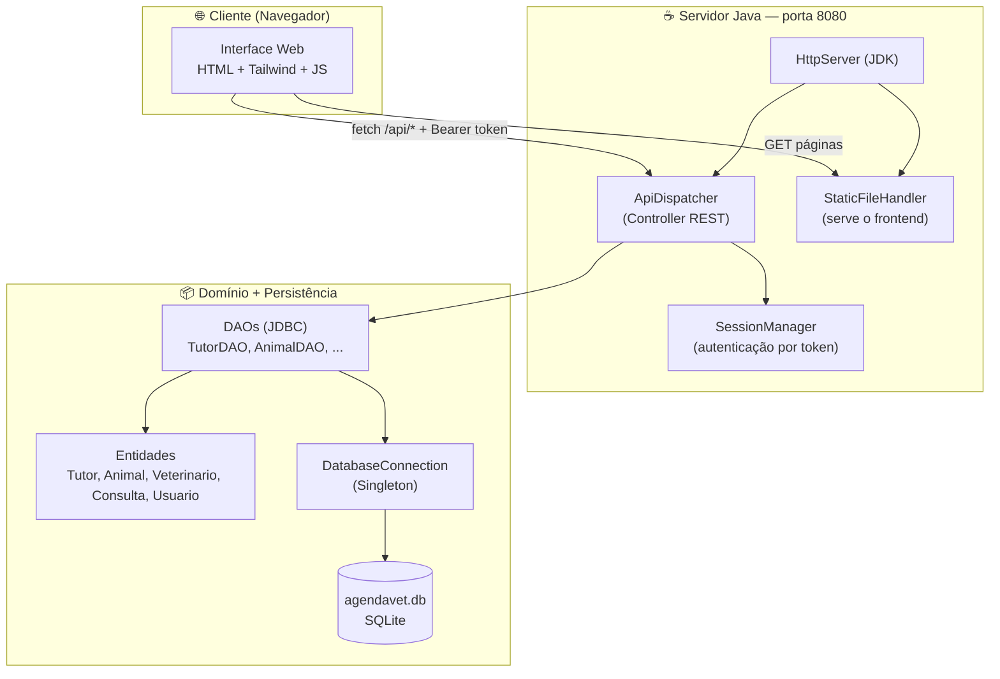

# 🐾 AgendAI.Vet — Sistema de Gestão de Clínica Veterinária

> Recorte funcional (MVP) desenvolvido para o **II InterConnect Evolution** — UNIFSA, Engenharia de Software.
> Integra os conteúdos das disciplinas de **Banco de Dados**, **Programação Orientada a Objetos (POO)** e **Design e Arquitetura de Software**.

O **AgendAI.Vet** é um sistema de gestão para clínicas veterinárias que permite o cadastro e o controle de **tutores**, **animais**, **veterinários** e **consultas**, com **login protegido por autenticação** e **persistência em banco de dados SQLite**. A aplicação expõe uma **API REST em Java** (servidor HTTP do próprio JDK) consumida por uma interface web.

---

## 📑 Sumário

1. [Integrantes do Grupo](#1-integrantes-do-grupo)
2. [Sobre o Sistema e Principais Funções](#2-sobre-o-sistema-e-principais-funções)
3. [Tecnologias Utilizadas](#3-tecnologias-utilizadas)
4. [Arquitetura (MVC)](#4-arquitetura-mvc)
5. [Diagrama de Entidade-Relacionamento (DER)](#5-diagrama-de-entidade-relacionamento-der)
6. [Diagrama de Componentes](#6-diagrama-de-componentes)
7. [Estrutura de Pastas](#7-estrutura-de-pastas)
8. [Modelo de Dados](#8-modelo-de-dados)
9. [API REST — Endpoints](#9-api-rest--endpoints)
10. [Conceitos de POO Aplicados](#10-conceitos-de-poo-aplicados)
11. [Padrões de Projeto e Boas Práticas](#11-padrões-de-projeto-e-boas-práticas)
12. [Como Rodar a Aplicação](#12-como-rodar-a-aplicação)
13. [Script SQL de Criação do Banco](#13-script-sql-de-criação-do-banco)
14. [Checklist de Inspeção de Qualidade](#14-checklist-de-inspeção-de-qualidade)
15. [Licença](#15-licença)

---

## 1. Integrantes do Grupo

1. ARTUR ALVES DE SOUSA
2. CAIO CAMPOS SILVA
3. GEOVANNY MAHTOS AGUIAR SILVA
4. ÍCARO RYAN COELHO COSTA
5. ISMAEL DE SOUSA SALES
6. JOÃO MANOEL DE SOUSA MORAIS
7. RYAN PORTO ANTUNES
8. ERICK RUAN NUNES VIEIRA
9. BILSÃ FERREIRA DE CARVALHO JÚNIOR

> A participação individual pode ser verificada pelo **histórico de commits** do repositório.

---

## 2. Sobre o Sistema e Principais Funções

O AgendAI.Vet centraliza a rotina administrativa de uma clínica veterinária. As principais funções são:

- **Autenticação de usuários** — login com e-mail e senha (hash SHA-256), controle de sessão por token e perfis de acesso (`admin` e `recepcao`).
- **Gestão de Tutores** — cadastro, listagem, edição e exclusão dos responsáveis pelos animais (CRUD completo).
- **Gestão de Animais** — cadastro dos pets vinculados a um tutor (CRUD completo, com relacionamento).
- **Gestão de Veterinários** — cadastro dos profissionais da clínica (CRUD completo).
- **Gestão de Consultas** — agendamento que relaciona um animal a um veterinário, com data e status (CRUD completo).
- **Dashboard** — painel inicial com contadores resumidos de tutores, animais, veterinários e consultas.

As **duas entidades principais com relacionamento** exigidas pelo trabalho são **Tutor** e **Animal** (1 tutor → N animais). O modelo ainda contempla **Consulta**, que conecta **Animal** e **Veterinário**, ampliando os relacionamentos.

---

## 3. Tecnologias Utilizadas

| Camada            | Tecnologia                                              |
| ----------------- | ------------------------------------------------------- |
| Linguagem/Backend | Java 17, JDBC                                           |
| Build             | Maven 3.8+                                              |
| Banco de Dados    | SQLite (`sqlite-jdbc` 3.45)                             |
| API               | `com.sun.net.httpserver.HttpServer` (JDK) + Gson (JSON) |
| Interface         | HTML5 + Tailwind CSS (CDN) + JavaScript (ES Modules)    |
| Autenticação      | Token UUID em memória + senhas com hash SHA-256         |

---

## 4. Arquitetura (MVC)

O projeto segue o padrão **MVC** com separação estrita de responsabilidades. Como a apresentação é feita por uma interface web consumindo uma API REST, as camadas MVC mapeiam-se da seguinte forma:

| Camada MVC          | Implementação no projeto                                                    | Pacote / Pasta                       |
| ------------------- | --------------------------------------------------------------------------- | ------------------------------------ |
| **Model**           | Entidades de domínio (`Tutor`, `Animal`, `Veterinario`, `Consulta`, `Usuario`) | `com.agendai.model`                  |
| **View**            | Telas HTML + CSS + JS que renderizam e capturam dados do usuário             | `frontend/`                          |
| **Controller**      | Roteador REST que recebe as requisições e orquestra as operações             | `com.agendai.controller` (`ApiDispatcher`) |
| **Repository / DAO**| Acesso a dados via JDBC (interfaces DAO + implementações)                     | `com.agendai.dao` (`*DAO`, `*DAOImpl`) |
| **Config**          | Conexão, criação de tabelas e carga inicial do banco                         | `com.agendai.config`                 |

O fluxo de uma requisição: **View (frontend) → Controller (ApiDispatcher) → DAO → Banco de Dados** e o caminho de volta com a resposta em JSON.

---

## 5. Diagrama de Entidade-Relacionamento (DER)



**Relacionamentos:**
- Um **Tutor** possui muitos **Animais** (1:N).
- Um **Animal** participa de muitas **Consultas** (1:N).
- Um **Veterinário** realiza muitas **Consultas** (1:N).
- **Usuário** é independente (responsável apenas pela autenticação).

---

## 6. Diagrama de Componentes



---

## 7. Estrutura de Pastas

```
AgendaVet/
├── README.md                       # Este arquivo
├── pom.xml                         # Dependências Maven (Java 17, SQLite, Gson)
├── run.bat                         # Atalho de execução no Windows
│
├── database/
│   └── schema.sql                  # Script SQL de criação das tabelas
│
├── frontend/                       # Camada View
│   ├── login.html                  # Tela de login
│   ├── index.html                  # Dashboard
│   ├── pages/                      # Telas de CRUD (tutores, animais, etc.)
│   ├── css/                        # Estilos
│   └── js/
│       ├── config/                 # Constantes globais
│       ├── services/               # Cliente da API REST e autenticação
│       ├── utils/                  # Helpers e proteção de rotas
│       └── pages/                  # Lógica de cada tela
│
└── src/main/java/com/agendai/
    ├── app/                        # Ponto de entrada
    │   └── Main.java
    │
    ├── model/                      # Model — entidades de domínio
    │   ├── EntidadeBase.java       # Classe ABSTRATA base das entidades
    │   ├── Tutor.java
    │   ├── Animal.java
    │   ├── Veterinario.java
    │   ├── Consulta.java
    │   └── Usuario.java
    │
    ├── dao/                        # Repository / DAO (acesso a dados)
    │   ├── TutorDAO.java        / TutorDAOImpl.java
    │   ├── AnimalDAO.java       / AnimalDAOImpl.java
    │   ├── VeterinarioDAO.java  / VeterinarioDAOImpl.java
    │   ├── ConsultaDAO.java     / ConsultaDAOImpl.java
    │   └── UsuarioDAO.java      / UsuarioDAOImpl.java
    │
    ├── controller/                 # Controller (REST)
    │   ├── ApiServer.java          # Inicia o servidor (porta 8080)
    │   ├── ApiDispatcher.java      # Roteamento /api/*
    │   ├── StaticFileHandler.java  # Serve o frontend/
    │   ├── SessionManager.java     # Sessões/token
    │   ├── HttpUtil.java           # Utilitários HTTP/JSON
    │   └── LoginRequest.java       # DTO de login
    │
    ├── config/                     # Config / Persistência
    │   ├── DatabaseConnection.java # Conexão Singleton com o SQLite
    │   ├── DatabaseInitializer.java# CREATE TABLE automático
    │   └── DataSeeder.java         # Dados de exemplo na 1ª execução
    │
    └── util/                       # Utilitários
        └── PasswordUtil.java       # Hash de senha (SHA-256)
```

---

## 8. Modelo de Dados

| Tabela        | Descrição                                              | Chaves                                       |
| ------------- | ------------------------------------------------------ | -------------------------------------------- |
| `usuario`     | Login (e-mail, senha em hash SHA-256, perfil)          | PK `id`                                      |
| `tutor`       | Responsáveis legais pelos animais                      | PK `id`                                      |
| `animal`      | Pets cadastrados                                       | PK `id`, FK `tutor_id` → `tutor(id)`         |
| `veterinario` | Profissionais da clínica                               | PK `id`                                      |
| `consulta`    | Agendamentos                                           | PK `id`, FK `animal_id`, FK `veterinario_id` |
| `dashboard`   | Contadores exibidos no painel                          | PK `id`                                      |

---

## 9. API REST — Endpoints

Base: `http://localhost:8080`

| Rota                     | Métodos          | Descrição                  | Autenticação |
| ------------------------ | ---------------- | -------------------------- | ------------ |
| `/api/auth/login`        | POST             | Login (retorna token)      | Não          |
| `/api/auth/logout`       | POST             | Encerra a sessão           | Sim          |
| `/api/auth/me`           | GET              | Dados do usuário logado    | Sim          |
| `/api/dashboard`         | GET              | Contadores do painel       | Sim          |
| `/api/tutores`           | GET, POST        | Listar / criar             | Sim          |
| `/api/tutores/{id}`      | GET, PUT, DELETE | Buscar / editar / excluir  | Sim          |
| `/api/animais`           | GET, POST        | Listar / criar             | Sim          |
| `/api/animais/{id}`      | GET, PUT, DELETE | Buscar / editar / excluir  | Sim          |
| `/api/veterinarios`      | GET, POST        | Listar / criar             | Sim          |
| `/api/veterinarios/{id}` | GET, PUT, DELETE | Buscar / editar / excluir  | Sim          |
| `/api/consultas`         | GET, POST        | Listar / criar             | Sim          |
| `/api/consultas/{id}`    | GET, PUT, DELETE | Buscar / editar / excluir  | Sim          |

**Autenticação:** após o login, envie o cabeçalho `Authorization: Bearer <token>`. Rotas protegidas retornam **401** sem token válido.

---

## 10. Conceitos de POO Aplicados

| Conceito                       | Onde aparece no projeto                                                                 |
| ------------------------------ | --------------------------------------------------------------------------------------- |
| **Classes, atributos, objetos e métodos** | Todas as entidades de domínio (`Tutor`, `Animal`, `Veterinario`, `Consulta`, `Usuario`) |
| **Encapsulamento**             | Atributos `private` com `getters` e `setters` em todas as entidades                     |
| **Modificadores de acesso**    | `private`, `protected`, `public`, `final` (ex.: `EntidadeBase`, `DatabaseConnection`)   |
| **Construtores / Sobrecarga**  | Cada entidade possui construtor vazio, com e sem `id` (sobrecarga de construtores)      |
| **Herança e Reuso**            | `EntidadeBase` centraliza `id`/`getId`/`setId`; todas as entidades a estendem (`extends`) |
| **Classe abstrata e método abstrato** | `EntidadeBase` é `abstract` e define `abstract String resumo()`, implementado por cada entidade |
| **Interfaces**                 | `TutorDAO`, `AnimalDAO`, `VeterinarioDAO`, `ConsultaDAO`, `UsuarioDAO` e respectivas implementações |
| **Sobrescrita (override)**     | `@Override` em `resumo()`, nos métodos das DAOs e em `toString()` das entidades         |
| **Coleções e Generics**        | `List<Tutor>`, `List<Animal>`, `Map<String, Object>` no retorno das listagens           |
| **Tratamento de exceções**     | Blocos `try/catch` em todas as operações JDBC, com `RuntimeException` descritiva        |
| **Documentação (comentários)** | Javadoc/comentários explicando responsabilidade de cada classe e módulo                 |

---

## 11. Padrões de Projeto e Boas Práticas

- **DAO (Data Access Object):** cada entidade tem uma interface DAO e uma implementação JDBC (`TutorDAO` → `TutorDAOImpl`, etc.), isolando o acesso a dados do restante do sistema.
- **Singleton:** `DatabaseConnection` mantém uma única instância de conexão com o SQLite, reaproveitada por toda a aplicação.
- **MVC:** separação de Model, View e Controller (ver seção [Arquitetura](#4-arquitetura-mvc)).
- **SOLID:**
  - *S* — cada classe tem uma única responsabilidade (entidade, DAO, conexão, roteamento).
  - *D* — o `ApiDispatcher` depende das **interfaces** DAO, não das implementações concretas.
- **DRY:** método auxiliar `mapear(ResultSet)` reaproveitado nas DAOs para converter linhas em objetos, evitando repetição.

---

## 12. Como Rodar a Aplicação

### Pré-requisitos
- **Java 17+**
- **Maven 3.8+**
- Navegador moderno (Chrome, Edge ou Firefox)

### Passo a passo

**1. Clonar o repositório**
```bash
git clone https://github.com/caio089/AgendaVet.git
cd AgendaVet
```

**2. Subir o servidor (backend + frontend juntos)**
```bash
mvn compile exec:java
```
> No Windows também é possível dar duplo clique em `run.bat`.
> Execute sempre na **raiz do projeto** (pasta onde está o `pom.xml`).

**3. Acessar no navegador**
```
http://localhost:8080/login.html
```

**4. Fazer login** (usuários criados automaticamente na primeira execução)

| Perfil   | E-mail                   | Senha         |
| -------- | ------------------------ | ------------- |
| Admin    | `admin@agendavet.com`    | `admin123`    |
| Recepção | `recepcao@agendavet.com` | `recepcao123` |

**5. Parar o servidor:** pressione `Ctrl + C` no terminal.

> O banco `agendavet.db` é criado automaticamente na raiz na primeira execução, já com as tabelas e dados de exemplo.

---

## 13. Script SQL de Criação do Banco

O script completo está em **`database/schema.sql`**. As tabelas também são criadas automaticamente pelo `DatabaseInitializer.java` ao iniciar o servidor. Para criar manualmente:

```bash
sqlite3 agendavet.db < database/schema.sql
```

```sql
PRAGMA foreign_keys = ON;

CREATE TABLE IF NOT EXISTS usuario (
    id      INTEGER PRIMARY KEY AUTOINCREMENT,
    nome    TEXT    NOT NULL,
    email   TEXT    NOT NULL UNIQUE,
    senha   TEXT    NOT NULL,
    perfil  TEXT    NOT NULL DEFAULT 'admin'
);

CREATE TABLE IF NOT EXISTS tutor (
    id        INTEGER PRIMARY KEY AUTOINCREMENT,
    nome      TEXT    NOT NULL,
    cpf       TEXT    NOT NULL UNIQUE,
    telefone  TEXT,
    endereco  TEXT
);

CREATE TABLE IF NOT EXISTS animal (
    id        INTEGER PRIMARY KEY AUTOINCREMENT,
    nome      TEXT    NOT NULL,
    especie   TEXT    NOT NULL,
    raca      TEXT,
    peso      REAL    NOT NULL,
    tutor_id  INTEGER NOT NULL,
    FOREIGN KEY (tutor_id) REFERENCES tutor(id)
);

CREATE TABLE IF NOT EXISTS veterinario (
    id             INTEGER PRIMARY KEY AUTOINCREMENT,
    nome           TEXT    NOT NULL,
    crmv           TEXT    NOT NULL UNIQUE,
    especialidade  TEXT    NOT NULL,
    telefone       TEXT    NOT NULL
);

CREATE TABLE IF NOT EXISTS consulta (
    id              INTEGER PRIMARY KEY AUTOINCREMENT,
    animal_id       INTEGER NOT NULL,
    veterinario_id  INTEGER NOT NULL,
    data_consulta   TEXT    NOT NULL,
    status          TEXT    NOT NULL,
    FOREIGN KEY (animal_id)      REFERENCES animal(id),
    FOREIGN KEY (veterinario_id) REFERENCES veterinario(id)
);

CREATE TABLE IF NOT EXISTS dashboard (
    id      INTEGER PRIMARY KEY AUTOINCREMENT,
    titulo  TEXT    NOT NULL,
    valor   INTEGER NOT NULL
);
```

---

## 14. Checklist de Inspeção de Qualidade

### Banco de Dados
- [x] DER lógico documentado
- [x] Script SQL de criação das tabelas
- [x] Chaves primárias (PK) definidas em todas as tabelas
- [x] Chaves estrangeiras (FK) definidas (`animal.tutor_id`, `consulta.animal_id`, `consulta.veterinario_id`)
- [x] Restrições de integridade (`NOT NULL`, `UNIQUE`)

### Programação Orientada a Objetos
- [x] Classes, atributos, objetos e métodos
- [x] Encapsulamento (atributos `private` + getters/setters)
- [x] Modificadores de acesso
- [x] Construtores (com sobrecarga)
- [x] Herança e reuso (`EntidadeBase` + `extends`)
- [x] Classe abstrata e método abstrato (`EntidadeBase`, `resumo()`)
- [x] Interfaces
- [x] Sobrescrita de métodos (`@Override`)
- [x] Coleções e Generics (`List<>`, `Map<>`)
- [x] Tratamento de exceções
- [x] Comentários documentando a lógica

### Arquitetura e Padrões de Projeto
- [x] Separação de responsabilidades em camadas (MVC)
- [x] Estrutura de pastas organizada por responsabilidade
- [x] Padrão DAO
- [x] Padrão Singleton
- [x] Princípios SOLID e DRY aplicados

### Entrega / Repositório
- [x] CRUD completo de pelo menos duas entidades com relacionamento
- [x] README com integrantes, descrição, DER, diagrama de componentes, checklist e instruções
- [x] Instruções de execução e script SQL

---

## 15. Licença

Projeto acadêmico — uso exclusivamente educacional.
Centro Universitário Santo Agostinho (UNIFSA) · Engenharia de Software · 2026.
