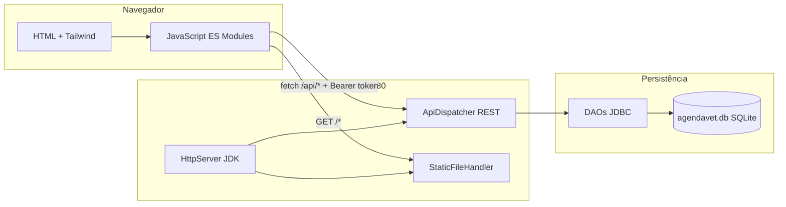

# AgendaVet

Sistema web de gestão de clínica veterinária desenvolvido como projeto acadêmico.  
Permite cadastrar **tutores**, **animais**, **veterinários** e **consultas**, com login protegido e persistência em **SQLite**.

> Documentação elaborada por **Arthur** · README e orientações de uso.

---

## Equipe

| Integrante | Responsabilidade |
|------------|------------------|
| **Caio** | Frontend, arquitetura e integração API |
| **Arthur** | README.md e documentação |
| **Icaro** | Banco SQLite e criação das tabelas |
| **Ryan** | CRUD de Tutores |
| **João** | CRUD de Animais |
| **Ismael** | CRUD de Veterinários |
| **Erick** | CRUD de Consultas |

---

## Requisitos

- **Java 17+**
- **Maven 3.8+**
- Navegador moderno (Chrome, Edge, Firefox)

---

## Como rodar (passo a passo)

### 1. Clonar o repositório

```bash
git clone https://github.com/caio089/AgendaVet.git
cd AgendaVet
```

### 2. Subir o servidor (backend + frontend juntos)

**Windows (PowerShell ou CMD):**

```bash
mvn compile exec:java
```

Ou dê duplo clique em `run.bat`.

**Linux / macOS:**

```bash
mvn compile exec:java
```

> Execute sempre na **raiz do projeto** (pasta onde está o `pom.xml`).

### 3. Acessar o sistema no navegador

Abra:

```
http://localhost:8080/login.html
```

### 4. Fazer login

| Usuário | E-mail | Senha | Perfil |
|---------|--------|-------|--------|
| Administrador | `admin@agendavet.com` | `admin123` | admin |
| Recepção | `recepcao@agendavet.com` | `recepcao123` | recepcao |

Após o login, você será redirecionado ao **Dashboard**.

### 5. Parar o servidor

No terminal onde o servidor está rodando, pressione **Ctrl + C**.

---

## Estrutura de pastas

```
AgendaVet/
│
├── README.md                 # Este arquivo (Arthur)
├── pom.xml                   # Dependências Maven (Java 17, SQLite, Gson)
├── run.bat                   # Atalho para iniciar no Windows
├── agendavet.db              # Banco SQLite (gerado automaticamente)
│
├── database/
│   └── schema.sql            # Script SQL com todas as tabelas
│
├── frontend/                 # Interface web (Caio)
│   ├── login.html            # Tela de login
│   ├── index.html            # Dashboard
│   ├── pages/                # Telas CRUD (tutores, animais, etc.)
│   ├── css/                  # Estilos complementares
│   └── js/
│       ├── config/           # Constantes globais
│       ├── services/         # Cliente API REST e autenticação
│       ├── utils/            # Helpers, auth-guard
│       └── pages/            # Lógica JavaScript de cada tela
│
└── src/main/java/com/agendai/
    ├── app/                  # Entidades + DAOs (JDBC)
    │   ├── Main.java         # Ponto de entrada
    │   ├── Tutor*.java       # Módulo Ryan
    │   ├── Animal*.java      # Módulo João
    │   ├── Veterinario*.java # Módulo Ismael
    │   ├── Consulta*.java    # Módulo Erick
    │   └── Usuario*.java     # Login e autenticação
    │
    ├── api/                  # Servidor HTTP REST (Caio)
    │   ├── ApiServer.java    # Inicia servidor na porta 8080
    │   ├── ApiDispatcher.java# Rotas /api/*
    │   ├── StaticFileHandler.java  # Serve o frontend/
    │   └── SessionManager.java     # Sessões de login (token)
    │
    └── database/             # Camada de banco (Icaro)
        ├── DatabaseConnection.java   # Conexão singleton SQLite
        ├── DatabaseInitializer.java  # CREATE TABLE automático
        └── DataSeeder.java           # Dados de exemplo na 1ª execução
```

---

## Arquitetura do sistema



---

## Como o banco de dados funciona

1. Ao iniciar o servidor, `DatabaseInitializer.java` executa o `CREATE TABLE IF NOT EXISTS` de todas as tabelas.
2. O arquivo **`agendavet.db`** é criado na raiz do projeto (JDBC URL: `jdbc:sqlite:agendavet.db`).
3. Na primeira execução, `DataSeeder.java` insere usuários de login e dados de demonstração.
4. O schema completo está documentado em **`database/schema.sql`** (pode ser consultado ou executado manualmente com SQLite CLI).

### Tabelas

| Tabela | Descrição |
|--------|-----------|
| `usuario` | Login (e-mail, senha hash SHA-256, perfil) |
| `tutor` | Responsáveis pelos animais |
| `animal` | Pets (FK → `tutor_id`) |
| `veterinario` | Profissionais da clínica |
| `consulta` | Agendamentos (FK → `animal_id`, `veterinario_id`) |
| `dashboard` | Contadores do painel |

---

## Como a API funciona

Servidor HTTP simples (**sem Spring Boot**), usando `com.sun.net.httpserver.HttpServer` do JDK.

| Rota | Método | Descrição | Auth |
|------|--------|-----------|------|
| `/api/auth/login` | POST | Login (retorna token) | Não |
| `/api/auth/logout` | POST | Encerra sessão | Sim |
| `/api/auth/me` | GET | Dados do usuário logado | Sim |
| `/api/dashboard` | GET | Contadores | Sim |
| `/api/tutores` | GET, POST | Listar / criar | Sim |
| `/api/tutores/{id}` | GET, PUT, DELETE | Buscar / editar / excluir | Sim |
| `/api/animais` | GET, POST | Idem | Sim |
| `/api/animais/{id}` | GET, PUT, DELETE | Idem | Sim |
| `/api/veterinarios` | GET, POST | Idem | Sim |
| `/api/veterinarios/{id}` | GET, PUT, DELETE | Idem | Sim |
| `/api/consultas` | GET, POST | Idem | Sim |
| `/api/consultas/{id}` | GET, PUT, DELETE | Idem | Sim |

**Autenticação:** após o login, envie o header:

```
Authorization: Bearer <token>
```

Rotas protegidas retornam **401** sem token válido.

---

## Como o frontend se conecta ao backend

1. **Mesma origem:** frontend e API rodam juntos em `http://localhost:8080` — sem problemas de CORS.
2. **`frontend/js/services/auth.js`** — faz login em `POST /api/auth/login` e guarda o token no `sessionStorage`.
3. **`frontend/js/services/api.js`** — envia `Authorization: Bearer <token>` em todas as requisições CRUD.
4. **`frontend/js/utils/auth-guard.js`** — bloqueia páginas internas e redireciona para `login.html` se não houver sessão.
5. Cada tela (`js/pages/*.js`) chama a API via `fetch` e renderiza os dados nas tabelas HTML.

### Fluxo resumido

```
login.html → POST /api/auth/login → token salvo
     ↓
index.html → GET /api/dashboard (com token) → exibe contadores
     ↓
pages/tutores.html → GET /api/tutores → tabela preenchida
```

---

## Tecnologias utilizadas

| Camada | Tecnologia |
|--------|------------|
| Backend | Java 17, JDBC, Maven |
| Banco | SQLite (`sqlite-jdbc`) |
| API | HttpServer (JDK) + Gson (JSON) |
| Frontend | HTML5, Tailwind CSS (CDN), JavaScript ES Modules |
| Autenticação | Token UUID em memória + SHA-256 para senhas |

---

## Problemas comuns

| Problema | Solução |
|----------|---------|
| `mvn` não reconhecido | Instale Maven e adicione ao PATH |
| Porta 8080 em uso | Encerre o processo anterior ou altere `PORT` em `ApiServer.java` |
| Página em branco / 401 | Faça login em `/login.html` |
| Banco corrompido | Delete `agendavet.db` e reinicie o servidor (recria tudo) |

---

## Licença

Projeto acadêmico — uso educacional.
